# Paper List
## lab07
*LAB* | *Name* | *Author*
:---: | :---: | :---:|
lab07_3 | [Dropout: A Simple Way to Prevent Neural Networks from Overfitting (http://jmlr.org/papers/volume15/srivastava14a.old/srivastava14a.pdf) | Nitish Srivastava , Geoffrey Hinton, Alex Krizhevsky, Ilya Sutskever et al.
lab07_4 | [Batch Normalization: Accelerating Deep Network Training by Reducing Internal Covariate Shift](https://arxiv.org/abs/1502.03167) |Sergey Ioffe, Christian Szegedy|
lab09_2 | [LONG SHORT-TERM MEMORY](http://www.bioinf.jku.at/publications/older/2604.pdf) |Sepp Hochreiter
, Jurgen Schmidhuber|

<!--
## regression

lab01-1 | lab01-5
:---: | :---: 
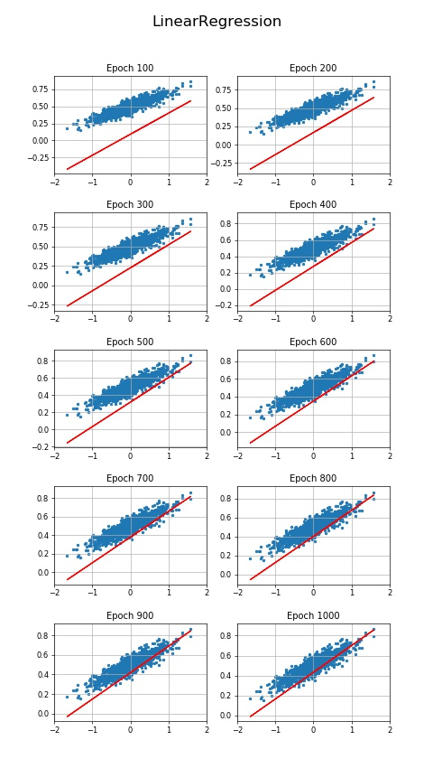 | 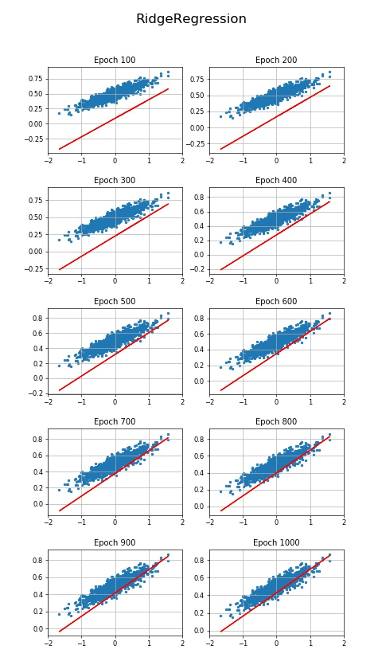

lab01-6 | lab01-7
:---: | :---: 
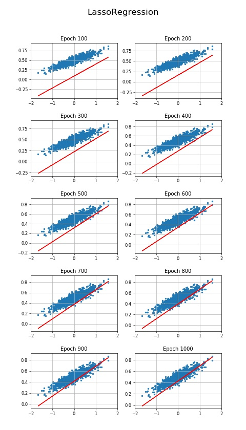 | 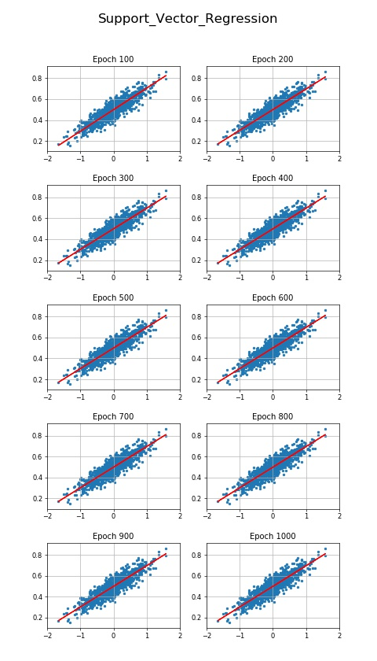 
 
## tensorboard

lab03-1 | lab03-2
:---: | :---: 
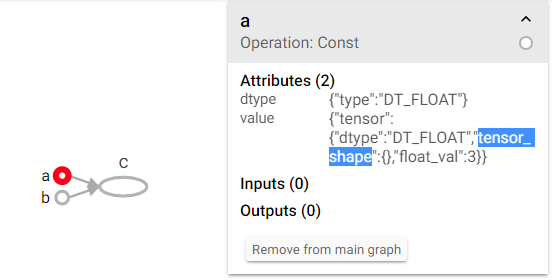 |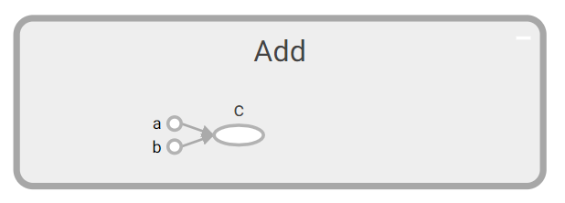 

lab03-3_graph
:---: 

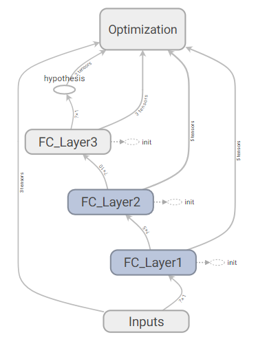 

*Name* | *W1* | *W2* | *W3*
:---: | :---: | :---: | :---: |
Weight | 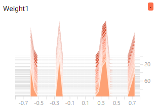 | 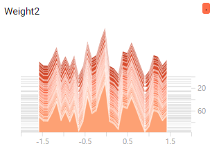 | 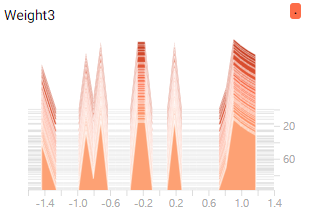 

lab03-5_graph
:---: 

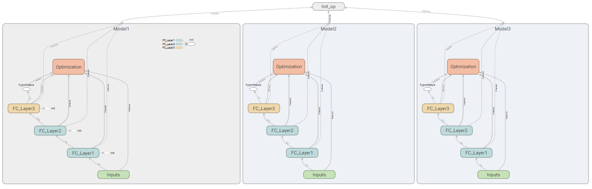 

 
## Data manipulation

lab04-4 average of losses and accuracies per Epoch
:---: 

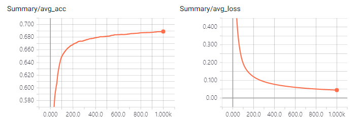 

## Activations

*Activation* |*Results*|
:---: | :---: |
Sigmoid  (lab05_1) |  

## MNIST and CIFAR10

### lab08-0

*MNIST* | *CIFAR10*
:---: |:---: |
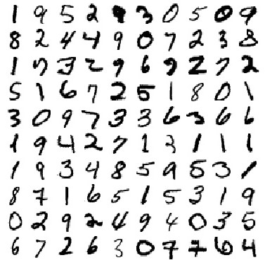 | 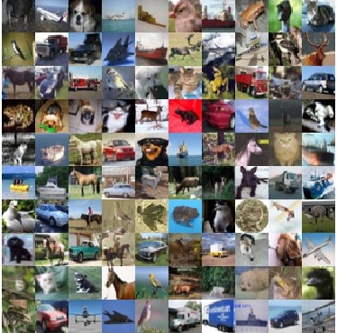 

## CNN MNIST

lab08-1 and lab08-2 comparision
:---: 
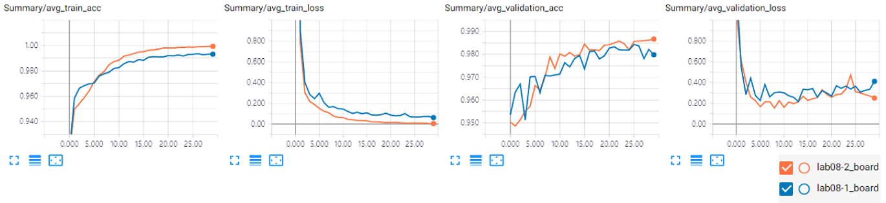 
-->
